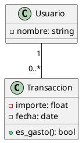

<div style="text-align: center;">


<h1>Unidad 4</h1>
<h2>Elaboración de diagramas de clases</h2>

<p>
<strong>Módulo:</strong> Entorns de Desenvolupament (EDE)<br>
<strong>Ciclo formativo:</strong> 1º DAW (Desarrollo de Aplicaciones Web)<br>
<strong>Curso:</strong> 2026-2027
</p>

<p>
<strong>Docente:</strong> Noel Marco Biendicho<br>
<strong>Centro:</strong> IES Sant Vicent Ferrer — Algemesí
</p>

</div>

<div style="page-break-after: always;"></div>

## Índice

1. Clases y objetos: fundamentos de la POO (CA 5a)
2. Relaciones entre clases (CA 5a)
3. Notación UML e interpretación de diagramas (CA 5c)
4. Herramientas para diagramas de clases (CA 5b)
5. Trazar diagramas desde especificaciones (CA 5d)
6. Generación automática de código (CA 5e)
7. Ingeniería inversa (CA 5f)
8. Reto de clase
9. Resumen de la unidad
10. Para saber más

<div style="page-break-after: always;"></div>

**RA cubierto:** RA5 (CA 5a-5f) — Genera diagrames de classes valorant la seua importància per a documentar el disseny d'una aplicació.

> 💻 **Cómo trabajar los ejercicios de esta unidad**: crea tu carpeta `UD04_TuNombre` dentro del repositorio del **dashboard de finanzas personales** (ya con control de versiones desde UD3). Vas a modelar con diagramas de clases las mismas entidades que vienes usando desde UD1: usuario, transacción y categoría — esta vez documentando su diseño antes (o a partir) del código.

## 🎯 Conceptos clave

Al terminar esta unidad sabrás:
- Modelar clases, objetos y sus relaciones (asociación, herencia, composición, agregación, realización y dependencia) con notación UML.
- Usar una herramienta de diagramas de clases para trazar un diseño desde una especificación y para interpretar uno ya existente.
- Pasar en las dos direcciones entre diagrama y código: generar código a partir de un diagrama, y generar un diagrama a partir de código mediante ingeniería inversa.

---

## 1. Clases y objetos: fundamentos de la POO (CA 5a)

### 1.1. Clase, objeto e instanciación

Una **clase** es una plantilla que define qué **atributos** (datos) y **métodos** (comportamiento) tendrán sus **objetos**. Un objeto es una **instancia** concreta de esa clase — igual que "coche" es un concepto y "el Seat gris matrícula 1234 ABC" es un coche concreto.

```python
class Transaccion:
    def __init__(self, importe, categoria, fecha):
        self.importe = importe
        self.categoria = categoria
        self.fecha = fecha

    def es_gasto(self):
        return self.importe < 0

t1 = Transaccion(-45.20, "Alimentación", "2027-01-10")  # instanciación
```

### 1.2. Visibilidad

UML marca la visibilidad de atributos y métodos con un símbolo delante del nombre:

| Símbolo | Visibilidad | Significado |
|---|---|---|
| `+` | Público | Accesible desde cualquier otra clase |
| `-` | Privado | Solo accesible desde dentro de la propia clase |
| `#` | Protegido | Accesible desde la propia clase y sus subclases |

**🧪 Ejercicio 1 — Primeras clases del dashboard**
En `ejercicio1.md`, define (en texto o pseudocódigo) las clases `Usuario`, `Transaccion` y `Categoria` del dashboard de finanzas: sus atributos principales, su visibilidad y al menos un método por clase. Crea también un objeto de ejemplo de cada una.

---

## 2. Relaciones entre clases (CA 5a)

> 🗺️ **Mapa visual — tipos de relación**

| Relación | Pregunta que responde | Símbolo UML (línea) | Ejemplo en el dashboard |
|---|---|---|---|
| **Asociación** | ¿Quién conoce a quién? | Línea simple | `Usuario` — `Transaccion` |
| **Herencia** | ¿Es un tipo de...? | Línea con triángulo hueco | `GastoRecurrente` es un tipo de `Transaccion` |
| **Composición** | ¿Es parte de, y no existe sin el todo? | Línea con rombo relleno | `Usuario` ◆— `CuentaBancaria` |
| **Agregación** | ¿Es parte de, pero puede existir sin el todo? | Línea con rombo hueco | `Categoria` ◇— `Transaccion` |
| **Realización** | ¿Implementa una interfaz? | Línea discontinua con triángulo hueco | `ExportadorPDF` realiza `Exportador` |
| **Dependencia** | ¿Usa a otra clase de forma puntual? | Línea discontinua con flecha | `InformeMensual` depende de `Transaccion` |

### 2.1. Asociación, navegabilidad y multiplicidad

Una **asociación** indica que una clase conoce a otra. La **navegabilidad** (flecha en un extremo) indica en qué sentido; la **multiplicidad** (junto a cada extremo) indica cuántos objetos participan:

```
Usuario "1" ────── "0..*" Transaccion
```

Un `Usuario` tiene de 0 a muchas `Transaccion`; cada `Transaccion` pertenece exactamente a 1 `Usuario`.

| Notación | Significado |
|---|---|
| `1` | Exactamente uno |
| `0..1` | Cero o uno |
| `0..*` (o `*`) | Cero o muchos |
| `1..*` | Uno o muchos |

### 2.2. Herencia

`GastoRecurrente` **hereda** de `Transaccion`: tiene todo lo que tiene una `Transaccion` (importe, categoría, fecha) más lo propio (una periodicidad). Evita repetir atributos y métodos comunes en varias clases.

### 2.3. Composición y agregación

Ambas expresan "parte de", pero se diferencian en el ciclo de vida:
- **Composición** (rombo relleno): si se destruye el todo, se destruyen las partes. Una `CuentaBancaria` no tiene sentido sin su `Usuario`.
- **Agregación** (rombo hueco): las partes pueden existir sin el todo. Si se elimina una `Categoria`, sus `Transaccion` asociadas pueden seguir existiendo (reasignadas o sin categoría).

### 2.4. Realización y dependencia

- **Realización**: una clase implementa el "contrato" de una interfaz (por ejemplo, `ExportadorPDF` y `ExportadorCSV` realizan ambas la interfaz `Exportador`, garantizando que las dos tengan un método `exportar()`).
- **Dependencia**: una clase usa a otra de forma puntual (como parámetro o variable local), sin guardar una referencia permanente — la relación más débil de todas.

**🧪 Ejercicio 2 — Relaciones del dashboard**
En `ejercicio2.md`, añade a las clases del ejercicio 1 al menos: una asociación con multiplicidad, una herencia y una composición o agregación. Justifica en una línea por qué cada relación es del tipo que has elegido (y no de otro).

---

## 3. Notación UML e interpretación de diagramas (CA 5c)

### 3.1. Anatomía de una clase en UML

```
┌─────────────────────────┐
│       Transaccion       │  ← nombre de la clase
├─────────────────────────┤
│ - importe: float        │  ← atributos (visibilidad, nombre, tipo)
│ - categoria: Categoria  │
│ - fecha: date           │
├─────────────────────────┤
│ + es_gasto(): bool      │  ← métodos (visibilidad, nombre, tipo de retorno)
└─────────────────────────┘
```

> 🧾 **No hace falta memorizar cada símbolo de memoria**: tendrás una chuleta con todos los símbolos de relación y multiplicidad vistos en esta unidad. Se evalúa que sepas **interpretarlos y elegir el correcto** al modelar, no que los reproduzcas sin consultarla.

**🧪 Ejercicio 3 — Interpretar un diagrama ajeno**
Se te entregará un diagrama de clases ya hecho (de un dominio distinto al dashboard, por ejemplo una biblioteca o una tienda online). En `ejercicio3.md`, responde: ¿qué clases hay?, ¿qué relaciones existen entre ellas y de qué tipo son?, ¿qué multiplicidades tiene cada asociación?

---

## 4. Herramientas para diagramas de clases (CA 5b)

| Herramienta | Formato | Ventaja principal | Cuándo usarla |
|---|---|---|---|
| **PlantUML** | Texto plano (`.puml`) | Versionable con Git — el diagrama es código | Diagramas que van a evolucionar junto al proyecto |
| **draw.io / diagrams.net** | Visual (arrastrar y soltar) | Edición rápida sin sintaxis | Bocetos rápidos o presentaciones puntuales |

Un diagrama de clases en PlantUML se ve así:



> 🧾 **No hace falta memorizar la sintaxis de PlantUML**: tendrás la chuleta con la sintaxis de clases, atributos, métodos y cada tipo de relación. Se evalúa que el diagrama resultante sea correcto, no que recuerdes de memoria cómo se escribe un rombo de composición.

### 4.1. Plan B: si la herramienta online falla

Tanto PlantUML como draw.io tienen versión online (plantuml.com, app.diagrams.net) que puede fallar por red o por saturación del servicio:

- **PlantUML**: instala la extensión de VS Codium (renderiza en local, sin depender de ningún servidor) — o ten preinstalado `plantuml.jar` en la VM portátil.
- **draw.io**: la aplicación de escritorio funciona sin conexión y guarda el archivo `.drawio` en local.
- Alternativa de urgencia sin ninguna instalación: dibujar el diagrama a mano en papel o pizarra digital y fotografiarlo — UML es una notación, no depende de ninguna herramienta concreta.

**🧪 Ejercicio 4 — Primer diagrama en PlantUML**
Instala la extensión de PlantUML en VS Codium (o usa plantuml.com si prefieres empezar online). Reescribe en PlantUML el diagrama del Ejercicio 2. Guarda el archivo `ejercicio4.puml` y una captura del resultado renderizado.

---

## 5. Trazar diagramas desde especificaciones (CA 5d)

Trazar un diagrama desde una especificación en texto es el proceso inverso a interpretarlo: hay que identificar clases (sustantivos), atributos (datos que necesita cada clase), métodos (verbos/acciones) y relaciones (cómo se conectan) a partir de una descripción.

> 🗺️ **Mapa visual — de la especificación al diagrama**

| Paso | Pregunta | En el texto de la especificación |
|---|---|---|
| 1. Identificar clases | ¿Qué "cosas" del dominio necesito modelar? | Sustantivos importantes |
| 2. Identificar atributos | ¿Qué datos guarda cada clase? | Datos mencionados junto a cada sustantivo |
| 3. Identificar métodos | ¿Qué acciones realiza cada clase? | Verbos asociados a cada sustantivo |
| 4. Identificar relaciones | ¿Cómo se conectan las clases entre sí? | Verbos que conectan dos sustantivos ("tiene", "pertenece a", "es un tipo de") |

**🧪 Ejercicio 5 — Especificación guiada**
Se te entregará una especificación breve de un dominio nuevo (por ejemplo, un sistema de reservas). En `ejercicio5.puml`, traza el diagrama de clases completo (clases, atributos, métodos, relaciones y multiplicidades) siguiendo los 4 pasos anteriores.

**🧪 Ejercicio 6 — El dashboard completo**
Amplía el diagrama del dashboard de finanzas personales (Ejercicios 1-2-4) añadiendo las clases que falten para cubrir: registro de ingresos y gastos, categorías, informes mensuales y exportación (PDF/CSV). El resultado debe usar al menos 4 de los 6 tipos de relación vistos en el punto 2. Guárdalo como `ejercicio6.puml`.

---

## 6. Generación automática de código (CA 5e)

Muchas herramientas de diagramas (incluidas extensiones de PlantUML e IDEs como IntelliJ) permiten generar el esqueleto de código directamente desde el diagrama: clases, atributos con su tipo y firmas de métodos vacías, listas para implementar.

```python
# Código generado automáticamente a partir del diagrama — pendiente de implementar
class Transaccion:
    def __init__(self, importe: float, fecha):
        self.importe = importe
        self.fecha = fecha

    def es_gasto(self) -> bool:
        pass  # TODO: implementar
```

> 📡 **Por qué importa hoy**: el diagrama deja de ser "un dibujo para el examen" y pasa a ser el punto de partida real del código — el diseño se piensa una vez y se traduce a la estructura del proyecto sin volver a escribirla a mano.

**🧪 Ejercicio 7 — Del diagrama al esqueleto de código**
A partir de tu diagrama del Ejercicio 6, genera (con la herramienta que uses, o escribiéndolo tú mismo/a siguiendo exactamente el diagrama) el esqueleto de código Python de las clases `Usuario`, `Transaccion` y `Categoria`, con sus atributos tipados y las firmas de sus métodos (sin implementar la lógica interna).

---

## 7. Ingeniería inversa (CA 5f)

La **ingeniería inversa** hace el camino contrario: a partir de código ya existente, se genera automáticamente el diagrama de clases que lo documenta. Es habitual al incorporarte a un proyecto sin documentación previa, o para comprobar que el diagrama y el código no se han desincronizado con el tiempo.

**🧪 Ejercicio 8 — Ingeniería inversa del dashboard**
Toma el código real de tu proyecto del dashboard de finanzas (el que ya tienes de UD1-UD3, no el esqueleto del ejercicio anterior) y genera su diagrama de clases mediante ingeniería inversa (extensión del IDE, o manualmente aplicando el proceso inverso al del punto 5). En `ejercicio8.md`, compara el resultado con el diagrama del Ejercicio 6: ¿coinciden? ¿Qué diferencias encuentras y por qué crees que existen?

---

## 🎯 Reto de clase

Vas a completar el ciclo diagrama ↔ código sobre una funcionalidad nueva del **dashboard de finanzas personales**: un sistema de **presupuestos por categoría** (el usuario fija un límite mensual de gasto para cada categoría y el sistema avisa si se supera).

En tu carpeta `UD04`, crea `reto.puml` y `reto.md` con:

1. **Diagrama de clases** (CA 5a, 5c, 5d): modela `Presupuesto` y su relación con `Categoria` y `Transaccion`, usando al menos 3 tipos de relación distintos (asociación con multiplicidad, y dos más a tu elección).
2. **Herramienta** (CA 5b): el diagrama debe estar escrito en PlantUML (no basta un boceto en draw.io sin exportar el código fuente `.puml`).
3. **Código generado** (CA 5e): el esqueleto de código Python de las clases nuevas, coherente con el diagrama.
4. **Verificación por ingeniería inversa** (CA 5f): implementa mínimamente el código (aunque sea de forma simple) y genera de nuevo el diagrama a partir de él. Comenta en `reto.md` si el resultado coincide con tu diagrama original.

**Plantilla orientativa para `reto.md`:**

```markdown
# Reto — Presupuestos por categoría

## 1. Diagrama de clases
- Clases nuevas: ___
- Relaciones usadas: ___ (justifica cada una en una línea)

## 2. Herramienta
- Archivo .puml adjunto: ___

## 3. Código generado
- Esqueleto de clases (archivo): ___

## 4. Verificación por ingeniería inversa
- ¿Coincide el diagrama regenerado con el original?: ___
- Diferencias encontradas: ___
```

*Variación evaluable*: quien lo prefiera puede partir del código ya implementado y trazar primero el diagrama por ingeniería inversa, documentando después si lo habría diseñado igual empezando desde cero.

---

<div style="page-break-after: always;"></div>

## Resumen de la unidad

**1. Clases y objetos** Una clase define atributos y métodos con una visibilidad (`+`, `-`, `#`); un objeto es una instancia concreta de esa clase.

**2. Relaciones entre clases** Asociación (con navegabilidad y multiplicidad), herencia, composición, agregación, realización y dependencia expresan de forma distinta cómo se conectan las clases — cada una responde a una pregunta de diseño diferente.

**3. Notación UML e interpretación** Cada clase se representa en tres compartimentos (nombre, atributos, métodos); interpretar un diagrama es identificar clases, relaciones y multiplicidades ya trazadas.

**4. Herramientas** PlantUML (texto, versionable con Git) y draw.io (visual, rápido) cubren necesidades distintas; ambas tienen alternativa local si su versión online falla.

**5. Trazar diagramas desde especificaciones** Identificar clases (sustantivos), atributos (datos), métodos (verbos) y relaciones (conexiones) a partir de un texto es el proceso inverso a interpretar un diagrama ya hecho.

**6. Generación automática de código** Un diagrama puede generar directamente el esqueleto de las clases que representa, sin volver a escribirlo a mano.

**7. Ingeniería inversa** El proceso contrario: generar el diagrama a partir del código existente, útil para documentar proyectos sin diagrama previo o comprobar que ambos siguen sincronizados.

---

## 📚 Para saber más (opcional, no evaluable)

- PlantUML — documentación de diagramas de clases: https://plantuml.com/es/class-diagram
- draw.io / diagrams.net: https://app.diagrams.net/
- UML Class Diagram — referencia visual: https://www.uml-diagrams.org/class-diagrams-overview.html

### 🧭 Por qué te va a servir esto de verdad

En cualquier proyecto real de cierto tamaño, el código por sí solo deja de ser suficiente para que un equipo entienda el diseño de un vistazo — el diagrama de clases (o su ausencia) es, muchas veces, la diferencia entre incorporarse a un proyecto en un día o en una semana.
