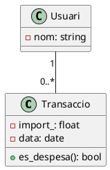

<div style="text-align: center;">


<h1>Unitat 4</h1>
<h2>Elaboració de diagrames de classes</h2>

<p>
<strong>Mòdul:</strong> Entorns de Desenvolupament (EDE)<br>
<strong>Cicle formatiu:</strong> 1r DAW (Desenvolupament d'Aplicacions Web)<br>
<strong>Curs:</strong> 2026-2027
</p>

<p>
<strong>Docent:</strong> Noel Marco Biendicho<br>
<strong>Centre:</strong> IES Sant Vicent Ferrer — Algemesí
</p>

</div>

<div style="page-break-after: always;"></div>

## Índex

1. Classes i objectes: fonaments de la POO (CA 5a)
2. Relacions entre classes (CA 5a)
3. Notació UML i interpretació de diagrames (CA 5c)
4. Ferramentes per a diagrames de classes (CA 5b)
5. Traçar diagrames des d'especificacions (CA 5d)
6. Generació automàtica de codi (CA 5e)
7. Enginyeria inversa (CA 5f)
8. Repte de classe
9. Resum de la unitat
10. Per a saber-ne més

<div style="page-break-after: always;"></div>

**RA cobert:** RA5 (CA 5a-5f) — Genera diagrames de classes valorant la seua importància per a documentar el disseny d'una aplicació.

> 💻 **Com treballar els exercicis d'esta unitat**: crea la teua carpeta `UD04_ElTeuNom` dins del repositori del **tauler de finances personals** (ja amb control de versions des d'UD3). Modelaràs amb diagrames de classes les mateixes entitats que uses des d'UD1: usuari, transacció i categoria — esta vegada documentant el seu disseny abans (o a partir) del codi.

## 🎯 Conceptes clau

En acabar esta unitat sabràs:
- Modelar classes, objectes i les seues relacions (associació, herència, composició, agregació, realització i dependència) amb notació UML.
- Usar una ferramenta de diagrames de classes per a traçar un disseny des d'una especificació i per a interpretar-ne un ja existent.
- Passar en les dos direccions entre diagrama i codi: generar codi a partir d'un diagrama, i generar un diagrama a partir de codi mitjançant enginyeria inversa.

---

## 1. Classes i objectes: fonaments de la POO (CA 5a)

### 1.1. Classe, objecte i instanciació

Una **classe** és una plantilla que definix quins **atributs** (dades) i **mètodes** (comportament) tindran els seus **objectes**. Un objecte és una **instància** concreta d'eixa classe — igual que "cotxe" és un concepte i "el Seat gris matrícula 1234 ABC" és un cotxe concret.

```python
class Transaccio:
    def __init__(self, import_, categoria, data):
        self.import_ = import_
        self.categoria = categoria
        self.data = data

    def es_despesa(self):
        return self.import_ < 0

t1 = Transaccio(-45.20, "Alimentació", "2027-01-10")  # instanciació
```

### 1.2. Visibilitat

UML marca la visibilitat d'atributs i mètodes amb un símbol davant del nom:

| Símbol | Visibilitat | Significat |
|---|---|---|
| `+` | Públic | Accessible des de qualsevol altra classe |
| `-` | Privat | Només accessible des de dins de la mateixa classe |
| `#` | Protegit | Accessible des de la mateixa classe i les seues subclasses |

**🧪 Exercici 1 — Primeres classes del dashboard**
En `exercici1.md`, definix (en text o pseudocodi) les classes `Usuari`, `Transaccio` i `Categoria` del tauler de finances: els seus atributs principals, la seua visibilitat i almenys un mètode per classe. Crea també un objecte d'exemple de cadascuna.

---

## 2. Relacions entre classes (CA 5a)

> 🗺️ **Mapa visual — tipus de relació**

| Relació | Pregunta que respon | Símbol UML (línia) | Exemple en el dashboard |
|---|---|---|---|
| **Associació** | Qui coneix a qui? | Línia simple | `Usuari` — `Transaccio` |
| **Herència** | És un tipus de...? | Línia amb triangle buit | `DespesaRecurrent` és un tipus de `Transaccio` |
| **Composició** | És part de, i no existix sense el tot? | Línia amb rombe ple | `Usuari` ◆— `ComptaBancaria` |
| **Agregació** | És part de, però pot existir sense el tot? | Línia amb rombe buit | `Categoria` ◇— `Transaccio` |
| **Realització** | Implementa una interfície? | Línia discontínua amb triangle buit | `ExportadorPDF` realitza `Exportador` |
| **Dependència** | Usa una altra classe de forma puntual? | Línia discontínua amb fletxa | `InformeMensual` depén de `Transaccio` |

### 2.1. Associació, navegabilitat i multiplicitat

Una **associació** indica que una classe coneix una altra. La **navegabilitat** (fletxa en un extrem) indica en quin sentit; la **multiplicitat** (junt a cada extrem) indica quants objectes participen:

```
Usuari "1" ────── "0..*" Transaccio
```

Un `Usuari` té de 0 a moltes `Transaccio`; cada `Transaccio` pertany exactament a 1 `Usuari`.

| Notació | Significat |
|---|---|
| `1` | Exactament un |
| `0..1` | Zero o un |
| `0..*` (o `*`) | Zero o molts |
| `1..*` | U o molts |

### 2.2. Herència

`DespesaRecurrent` **hereta** de `Transaccio`: té tot allò que té una `Transaccio` (import, categoria, data) més el que és propi (una periodicitat). Evita repetir atributs i mètodes comuns en diverses classes.

### 2.3. Composició i agregació

Ambdós expressen "part de", però es diferencien en el cicle de vida:
- **Composició** (rombe ple): si es destruïx el tot, es destruïxen les parts. Un `ComptaBancaria` no té sentit sense el seu `Usuari`.
- **Agregació** (rombe buit): les parts poden existir sense el tot. Si s'elimina una `Categoria`, les seues `Transaccio` associades poden continuar existint (reassignades o sense categoria).

### 2.4. Realització i dependència

- **Realització**: una classe implementa el "contracte" d'una interfície (per exemple, `ExportadorPDF` i `ExportadorCSV` realitzen totes dos la interfície `Exportador`, garantint que les dos tinguen un mètode `exportar()`).
- **Dependència**: una classe usa una altra de forma puntual (com a paràmetre o variable local), sense guardar una referència permanent — la relació més feble de totes.

**🧪 Exercici 2 — Relacions del dashboard**
En `exercici2.md`, afig a les classes de l'exercici 1 almenys: una associació amb multiplicitat, una herència i una composició o agregació. Justifica en una línia per què cada relació és del tipus que has triat (i no d'un altre).

---

## 3. Notació UML i interpretació de diagrames (CA 5c)

### 3.1. Anatomia d'una classe en UML

```
┌─────────────────────────┐
│       Transaccio        │  ← nom de la classe
├─────────────────────────┤
│ - import_: float        │  ← atributs (visibilitat, nom, tipus)
│ - categoria: Categoria  │
│ - data: date            │
├─────────────────────────┤
│ + es_despesa(): bool    │  ← mètodes (visibilitat, nom, tipus de retorn)
└─────────────────────────┘
```

> 🧾 **No cal memoritzar cada símbol de memòria**: tindràs una chuleta amb tots els símbols de relació i multiplicitat vists en esta unitat. S'avalua que sàpies **interpretar-los i triar el correcte** en modelar, no que els reproduïsques sense consultar-la.

**🧪 Exercici 3 — Interpretar un diagrama alié**
Se't lliurarà un diagrama de classes ja fet (d'un domini distint al dashboard, per exemple una biblioteca o una botiga online). En `exercici3.md`, respon: quines classes hi ha?, quines relacions existixen entre elles i de quin tipus són?, quina multiplicitat té cada associació?

---

## 4. Ferramentes per a diagrames de classes (CA 5b)

| Ferramenta | Format | Avantatge principal | Quan usar-la |
|---|---|---|---|
| **PlantUML** | Text pla (`.puml`) | Versionable amb Git — el diagrama és codi | Diagrames que evolucionaran junt amb el projecte |
| **draw.io / diagrams.net** | Visual (arrossegar i deixar anar) | Edició ràpida sense sintaxi | Esborranys ràpids o presentacions puntuals |

Un diagrama de classes en PlantUML es veu així:



> 🧾 **No cal memoritzar la sintaxi de PlantUML**: tindràs la chuleta amb la sintaxi de classes, atributs, mètodes i cada tipus de relació. S'avalua que el diagrama resultant siga correcte, no que recordes de memòria com s'escriu un rombe de composició.

### 4.1. Pla B: si la ferramenta online falla

Tant PlantUML com draw.io tenen versió online (plantuml.com, app.diagrams.net) que pot fallar per xarxa o per saturació del servei:

- **PlantUML**: instal·la l'extensió de VS Codium (renderitza en local, sense dependre de cap servidor) — o tin preinstal·lat `plantuml.jar` en la VM portàtil.
- **draw.io**: l'aplicació d'escriptori funciona sense connexió i guarda el fitxer `.drawio` en local.
- Alternativa d'urgència sense cap instal·lació: dibuixar el diagrama a mà en paper o pissarra digital i fotografiar-lo — UML és una notació, no depén de cap ferramenta concreta.

**🧪 Exercici 4 — Primer diagrama en PlantUML**
Instal·la l'extensió de PlantUML en VS Codium (o usa plantuml.com si prefereixes començar online). Reescriu en PlantUML el diagrama de l'Exercici 2. Guarda el fitxer `exercici4.puml` i una captura del resultat renderitzat.

---

## 5. Traçar diagrames des d'especificacions (CA 5d)

Traçar un diagrama des d'una especificació en text és el procés invers a interpretar-lo: cal identificar classes (substantius), atributs (dades que necessita cada classe), mètodes (verbs/accions) i relacions (com es connecten) a partir d'una descripció.

> 🗺️ **Mapa visual — de l'especificació al diagrama**

| Pas | Pregunta | En el text de l'especificació |
|---|---|---|
| 1. Identificar classes | Quines "coses" del domini necessite modelar? | Substantius importants |
| 2. Identificar atributs | Quines dades guarda cada classe? | Dades mencionades junt a cada substantiu |
| 3. Identificar mètodes | Quines accions realitza cada classe? | Verbs associats a cada substantiu |
| 4. Identificar relacions | Com es connecten les classes entre si? | Verbs que connecten dos substantius ("té", "pertany a", "és un tipus de") |

**🧪 Exercici 5 — Especificació guiada**
Se't lliurarà una especificació breu d'un domini nou (per exemple, un sistema de reserves). En `exercici5.puml`, traça el diagrama de classes complet (classes, atributs, mètodes, relacions i multiplicitats) seguint els 4 passos anteriors.

**🧪 Exercici 6 — El dashboard complet**
Amplia el diagrama del tauler de finances personals (Exercicis 1-2-4) afegint les classes que falten per a cobrir: registre d'ingressos i despeses, categories, informes mensuals i exportació (PDF/CSV). El resultat ha d'usar almenys 4 dels 6 tipus de relació vistos en el punt 2. Guarda'l com `exercici6.puml`.

---

## 6. Generació automàtica de codi (CA 5e)

Moltes ferramentes de diagrames (incloses extensions de PlantUML i IDE com IntelliJ) permeten generar l'esquelet de codi directament des del diagrama: classes, atributs amb el seu tipus i firmes de mètodes buides, a punt per a implementar.

```python
# Codi generat automàticament a partir del diagrama — pendent d'implementar
class Transaccio:
    def __init__(self, import_: float, data):
        self.import_ = import_
        self.data = data

    def es_despesa(self) -> bool:
        pass  # TODO: implementar
```

> 📡 **Per què importa hui**: el diagrama deixa de ser "un dibuix per a l'examen" i passa a ser el punt de partida real del codi — el disseny es pensa una vegada i es tradueix a l'estructura del projecte sense tornar a escriure-la a mà.

**🧪 Exercici 7 — Del diagrama a l'esquelet de codi**
A partir del teu diagrama de l'Exercici 6, genera (amb la ferramenta que uses, o escrivint-lo tu mateix/a seguint exactament el diagrama) l'esquelet de codi Python de les classes `Usuari`, `Transaccio` i `Categoria`, amb els seus atributs tipats i les firmes dels seus mètodes (sense implementar la lògica interna).

---

## 7. Enginyeria inversa (CA 5f)

L'**enginyeria inversa** fa el camí contrari: a partir de codi ja existent, es genera automàticament el diagrama de classes que el documenta. És habitual en incorporar-te a un projecte sense documentació prèvia, o per a comprovar que el diagrama i el codi no s'han desincronitzat amb el temps.

**🧪 Exercici 8 — Enginyeria inversa del dashboard**
Pren el codi real del teu projecte del tauler de finances (el que ja tens d'UD1-UD3, no l'esquelet de l'exercici anterior) i genera el seu diagrama de classes mitjançant enginyeria inversa (extensió de l'IDE, o manualment aplicant el procés invers al del punt 5). En `exercici8.md`, compara el resultat amb el diagrama de l'Exercici 6: coincidixen? Quines diferències trobes i per què creus que existixen?

---

## 🎯 Repte de classe

Completaràs el cicle diagrama ↔ codi sobre una funcionalitat nova del **tauler de finances personals**: un sistema de **pressupostos per categoria** (l'usuari fixa un límit mensual de despesa per a cada categoria i el sistema avisa si se supera).

En la teua carpeta `UD04`, crea `repte.puml` i `repte.md` amb:

1. **Diagrama de classes** (CA 5a, 5c, 5d): modela `Pressupost` i la seua relació amb `Categoria` i `Transaccio`, usant almenys 3 tipus de relació distints (associació amb multiplicitat, i dos més a la teua elecció).
2. **Ferramenta** (CA 5b): el diagrama ha d'estar escrit en PlantUML (no n'hi ha prou amb un esborrany en draw.io sense exportar el codi font `.puml`).
3. **Codi generat** (CA 5e): l'esquelet de codi Python de les classes noves, coherent amb el diagrama.
4. **Verificació per enginyeria inversa** (CA 5f): implementa mínimament el codi (encara que siga de forma senzilla) i genera de nou el diagrama a partir d'ell. Comenta en `repte.md` si el resultat coincidix amb el teu diagrama original.

**Plantilla orientativa per a `repte.md`:**

```markdown
# Repte — Pressupostos per categoria

## 1. Diagrama de classes
- Classes noves: ___
- Relacions usades: ___ (justifica cadascuna en una línia)

## 2. Ferramenta
- Fitxer .puml adjunt: ___

## 3. Codi generat
- Esquelet de classes (fitxer): ___

## 4. Verificació per enginyeria inversa
- Coincidix el diagrama regenerat amb l'original?: ___
- Diferències trobades: ___
```

*Variació avaluable*: qui ho preferisca pot partir del codi ja implementat i traçar primer el diagrama per enginyeria inversa, documentant després si l'hauria dissenyat igual començant des de zero.

---

<div style="page-break-after: always;"></div>

## Resum de la unitat

**1. Classes i objectes** Una classe definix atributs i mètodes amb una visibilitat (`+`, `-`, `#`); un objecte és una instància concreta d'eixa classe.

**2. Relacions entre classes** Associació (amb navegabilitat i multiplicitat), herència, composició, agregació, realització i dependència expressen de forma distinta com es connecten les classes — cadascuna respon a una pregunta de disseny diferent.

**3. Notació UML i interpretació** Cada classe es representa en tres compartiments (nom, atributs, mètodes); interpretar un diagrama és identificar classes, relacions i multiplicitats ja traçades.

**4. Ferramentes** PlantUML (text, versionable amb Git) i draw.io (visual, ràpid) cobrixen necessitats distintes; ambdós tenen alternativa local si la seua versió online falla.

**5. Traçar diagrames des d'especificacions** Identificar classes (substantius), atributs (dades), mètodes (verbs) i relacions (connexions) a partir d'un text és el procés invers a interpretar un diagrama ja fet.

**6. Generació automàtica de codi** Un diagrama pot generar directament l'esquelet de les classes que representa, sense tornar a escriure'l a mà.

**7. Enginyeria inversa** El procés contrari: generar el diagrama a partir del codi existent, útil per a documentar projectes sense diagrama previ o comprovar que ambdós continuen sincronitzats.

---

## 📚 Per a saber-ne més (opcional, no avaluable)

- PlantUML — documentació de diagrames de classes: https://plantuml.com/es/class-diagram
- draw.io / diagrams.net: https://app.diagrams.net/
- UML Class Diagram — referència visual: https://www.uml-diagrams.org/class-diagrams-overview.html

### 🧭 Per què et servirà açò de veritat

En qualsevol projecte real de cert grandària, el codi per si sol deixa de ser suficient perquè un equip entenga el disseny d'una ullada — el diagrama de classes (o la seua absència) és, moltes vegades, la diferència entre incorporar-se a un projecte en un dia o en una setmana.
