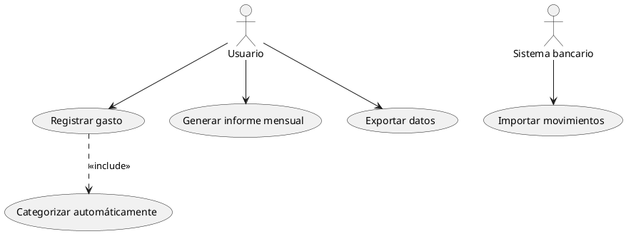
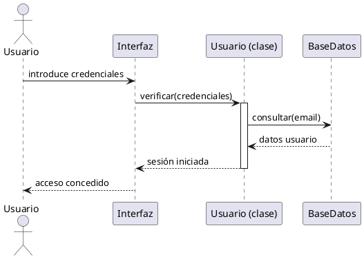
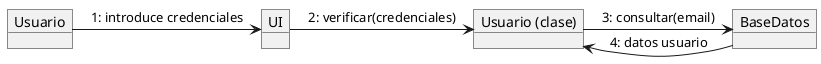
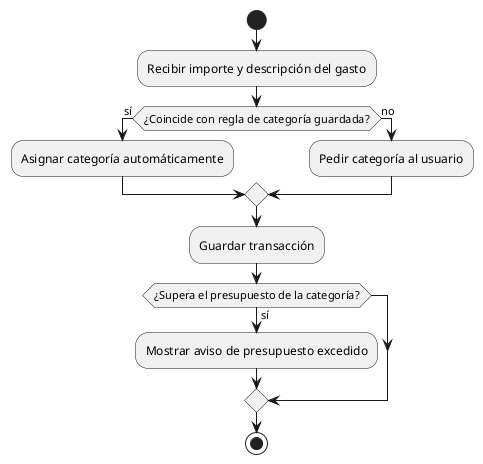
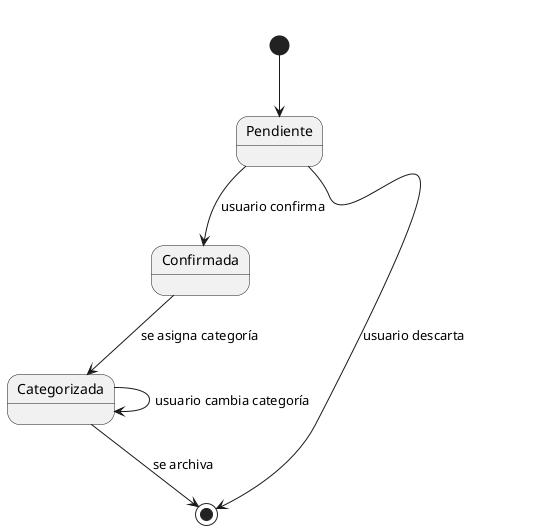

<div style="text-align: center;">


<h1>Unidad 5</h1>
<h2>Elaboración de diagramas de comportamiento</h2>

<p>
<strong>Módulo:</strong> Entorns de Desenvolupament (EDE)<br>
<strong>Ciclo formativo:</strong> 1º DAW (Desarrollo de Aplicaciones Web)<br>
<strong>Curso:</strong> 2026-2027
</p>

<p>
<strong>Docente:</strong> Noel Marco Biendicho<br>
<strong>Centro:</strong> IES Sant Vicent Ferrer — Algemesí
</p>

</div>

<div style="page-break-after: always;"></div>

## Índice

1. Tipos de diagramas de comportamiento (CA 6a)
2. Diagrama de casos de uso (CA 6b)
3. Diagramas de interacción: secuencia y comunicación (CA 6c, 6d)
4. Diagramas de actividad (CA 6e, 6f)
5. Diagramas de estado (CA 6g, 6h)
6. Reto de clase
7. Resumen de la unidad
8. Para saber más

<div style="page-break-after: always;"></div>

**RA cubierto:** RA6 (CA 6a-6h) — Genera diagrames de comportament valorant la seua importància per a documentar el disseny d'una aplicació.

> 💡 **Nota de estudio**: en UD4 modelaste la **estructura** del dashboard de finanzas (qué clases hay y cómo se relacionan). Esta unidad modela su **comportamiento**: qué pasa cuando alguien lo usa, en qué orden ocurren las cosas y por qué estados pasa cada elemento.

> 💻 **Cómo trabajar los ejercicios de esta unidad**: sigue en tu carpeta `UD05_TuNombre` dentro del repositorio del dashboard. Todos los diagramas se hacen en PlantUML (misma herramienta que en UD4, con su propia sintaxis para cada tipo de diagrama).

## 🎯 Conceptos clave

Al terminar esta unidad sabrás:
- Distinguir los distintos tipos de diagramas de comportamiento UML y para qué sirve cada uno.
- Interpretar y elaborar diagramas de casos de uso, de interacción (secuencia y comunicación), de actividad y de estado.
- Elegir qué diagrama de comportamiento usar según qué se necesite documentar: qué puede hacer un usuario, en qué orden ocurren las cosas, o por qué estados pasa un objeto.

---

## 1. Tipos de diagramas de comportamiento (CA 6a)

> 🗺️ **Mapa visual — qué pregunta responde cada diagrama**

| Diagrama | Pregunta que responde | Ejemplo en el dashboard |
|---|---|---|
| **Casos de uso** | ¿Qué puede hacer cada tipo de usuario? | Registrar gasto, generar informe, exportar datos |
| **Secuencia** | ¿En qué orden se envían los mensajes entre objetos, con el tiempo? | Inicio de sesión paso a paso |
| **Comunicación** | ¿Qué objetos se envían mensajes entre sí (sin importar el orden temporal exacto)? | Los mismos mensajes del inicio de sesión, vistos como red de objetos |
| **Actividad** | ¿Qué flujo de pasos y decisiones sigue un proceso? | Proceso de categorización automática de un gasto |
| **Estado** | ¿Por qué estados pasa un objeto a lo largo de su vida? | Ciclo de vida de una `Transaccion`: pendiente → confirmada → categorizada |

Los dos primeros (casos de uso, interacción) documentan **qué interactúa con qué**; actividad y estado documentan **cómo cambian las cosas con el tiempo** dentro de un mismo proceso u objeto.

---

## 2. Diagrama de casos de uso (CA 6b)

Un **caso de uso** es una funcionalidad completa que un **actor** (persona o sistema externo) puede realizar. El diagrama no muestra cómo se hace, solo qué se puede hacer y quién lo hace.



| Elemento | Significado |
|---|---|
| Actor (muñeco) | Quién interactúa con el sistema (persona o sistema externo) |
| Óvalo | Un caso de uso (una funcionalidad completa) |
| Línea actor-caso de uso | El actor participa en ese caso de uso |
| `<<include>>` | Un caso de uso incluye obligatoriamente a otro |
| `<<extend>>` | Un caso de uso extiende opcionalmente a otro |

**🧪 Ejercicio 1 — Casos de uso del dashboard**
En `ejercicio1.puml`, dibuja el diagrama de casos de uso completo del dashboard de finanzas: identifica al menos 2 actores (por ejemplo, Usuario y Sistema bancario externo) y 5 casos de uso, con al menos una relación `<<include>>` o `<<extend>>`.

---

## 3. Diagramas de interacción: secuencia y comunicación (CA 6c, 6d)

### 3.1. Diagrama de secuencia: interpretar

El diagrama de secuencia muestra el **orden temporal** en que los objetos se envían mensajes, leyéndose de arriba abajo.



| Elemento | Significado |
|---|---|
| Línea vertical bajo cada objeto | **Línea de vida**: el objeto existe durante ese tiempo |
| Rectángulo estrecho sobre la línea de vida | **Activación**: el objeto está ejecutando algo en ese momento |
| Flecha continua | Mensaje síncrono (espera respuesta) |
| Flecha discontinua | Mensaje de respuesta |

### 3.2. Diagrama de secuencia: elaborar

**🧪 Ejercicio 2 — Secuencia de inicio de sesión**
En `ejercicio2.puml`, elabora el diagrama de secuencia completo del inicio de sesión del dashboard (puedes partir del ejemplo del punto 3.1 y ampliarlo con al menos un caso de error: credenciales incorrectas).

### 3.3. Diagrama de comunicación: interpretar

Muestra los **mismos mensajes** que un diagrama de secuencia, pero organizados como una red de objetos en vez de una línea temporal — el orden se indica numerando los mensajes en vez de con la posición vertical.



> 📡 **Por qué importa hoy**: secuencia y comunicación documentan exactamente lo mismo con distinto énfasis — secuencia resalta el **tiempo**, comunicación resalta **quién habla con quién**. Se elige uno u otro según qué se quiera comunicar, no porque uno sea "mejor".

### 3.4. Diagrama de comunicación: elaborar

**🧪 Ejercicio 3 — Comunicación del registro de un gasto**
En `ejercicio3.puml`, elabora el diagrama de comunicación (no de secuencia) del proceso de registrar un gasto nuevo en el dashboard, numerando los mensajes en el orden correcto.

---

## 4. Diagramas de actividad (CA 6e, 6f)

### 4.1. Interpretar un diagrama de actividad

Modela el **flujo de un proceso**: pasos, decisiones y caminos alternativos — muy parecido a un diagrama de flujo clásico, pero con notación UML.



| Elemento | Significado |
|---|---|
| Círculo relleno | Inicio del proceso |
| Círculo con borde | Fin del proceso |
| Rectángulo redondeado | Una acción |
| Rombo (`if/then/else`) | Una decisión con caminos alternativos |

### 4.2. Elaborar un diagrama de actividad

**🧪 Ejercicio 4 — Flujo de categorización automática**
En `ejercicio4.puml`, elabora el diagrama de actividad completo del proceso de categorización automática de un gasto (puedes ampliar el ejemplo del punto 4.1 con un paso adicional, por ejemplo revisar si el gasto es recurrente).

**🧪 Ejercicio 5 — Flujo de generación de un informe mensual**
En `ejercicio5.puml`, elabora el diagrama de actividad del proceso de generar un informe mensual: desde que el usuario lo solicita hasta que se muestra o exporta, incluyendo al menos una decisión (por ejemplo, si hay o no transacciones ese mes).

---

## 5. Diagramas de estado (CA 6g, 6h)

### 5.1. Interpretar un diagrama de estado

Modela los **estados** por los que pasa un único objeto a lo largo de su vida, y qué evento provoca cada cambio de estado.



| Elemento | Significado |
|---|---|
| `[*]` inicial | Punto de inicio (el objeto aún no existe como tal) |
| Óvalo | Un estado |
| Flecha con etiqueta | Un evento que provoca la transición de un estado a otro |
| `[*]` final | Punto de fin (el objeto deja de tener ese ciclo de vida) |

### 5.2. Elaborar un diagrama de estado

**🧪 Ejercicio 6 — Ciclo de vida de un Presupuesto**
En `ejercicio6.puml`, elabora el diagrama de estado completo de un `Presupuesto` (de UD4): por ejemplo, estados como *Activo*, *Cerca del límite*, *Superado* y *Cerrado (fin de mes)*, con los eventos que provocan cada transición.

---

## 🎯 Reto de clase

Vas a documentar el comportamiento completo de la funcionalidad de **presupuestos por categoría** que ya diseñaste estructuralmente en el Reto de UD4.

En tu carpeta `UD05`, crea los siguientes archivos:

1. **Caso de uso** (CA 6b): `reto_casouso.puml` — el caso de uso "Consultar estado del presupuesto", con al menos un actor y una relación `<<include>>` o `<<extend>>`.
2. **Interacción** (CA 6c, 6d): `reto_secuencia.puml` — el diagrama de secuencia **o** de comunicación (a tu elección) de qué ocurre cuando una transacción nueva hace que se supere un presupuesto.
3. **Actividad** (CA 6e, 6f): `reto_actividad.puml` — el flujo completo de comprobación de presupuesto al registrar un gasto, con al menos una decisión.
4. **Estado** (CA 6g, 6h): `reto_estado.puml` — el ciclo de vida completo del `Presupuesto` (puedes reutilizar y ampliar el Ejercicio 6).

En `reto.md`, enlaza los 4 diagramas y explica en 3-4 líneas por qué cada uno documenta un aspecto distinto de la misma funcionalidad.

**Plantilla orientativa para `reto.md`:**

```markdown
# Reto — Comportamiento del sistema de presupuestos

## 1. Caso de uso
- Archivo: reto_casouso.puml
- Actor(es): ___

## 2. Interacción (secuencia o comunicación)
- Archivo: reto_secuencia.puml
- Tipo elegido y por qué: ___

## 3. Actividad
- Archivo: reto_actividad.puml
- Decisión(es) incluida(s): ___

## 4. Estado
- Archivo: reto_estado.puml
- Estados y eventos: ___

## Por qué 4 diagramas y no uno solo
___
```

*Variación evaluable*: quien lo prefiera puede documentar una funcionalidad propia distinta a los presupuestos (por ejemplo, la exportación de datos), siempre que use los 4 tipos de diagrama de esta unidad sobre esa misma funcionalidad.

---

<div style="page-break-after: always;"></div>

## Resumen de la unidad

**1. Tipos de diagramas de comportamiento** Casos de uso e interacción documentan qué interactúa con qué; actividad y estado documentan cómo cambian las cosas con el tiempo.

**2. Diagrama de casos de uso** Muestra qué funcionalidades completas puede realizar cada actor, sin detallar cómo se hacen — con relaciones `<<include>>` y `<<extend>>` entre casos de uso.

**3. Diagramas de interacción** Secuencia (orden temporal, líneas de vida y activaciones) y comunicación (red de objetos con mensajes numerados) documentan la misma información con distinto énfasis.

**4. Diagramas de actividad** Modelan el flujo de pasos y decisiones de un proceso, de forma parecida a un diagrama de flujo clásico.

**5. Diagramas de estado** Modelan los estados por los que pasa un objeto a lo largo de su vida y los eventos que provocan cada transición.

---

## 📚 Para saber más (opcional, no evaluable)

- PlantUML — diagramas de casos de uso: https://plantuml.com/es/use-case-diagram
- PlantUML — diagramas de secuencia: https://plantuml.com/es/sequence-diagram
- PlantUML — diagramas de actividad: https://plantuml.com/es/activity-diagram-beta
- PlantUML — diagramas de estado: https://plantuml.com/es/state-diagram

### 🧭 Por qué te va a servir esto de verdad

Un diagrama de clases (UD4) dice de qué está hecho un sistema; los diagramas de esta unidad dicen cómo se comporta cuando alguien lo usa de verdad — son las dos mitades de la documentación de diseño que cualquier equipo espera encontrar antes de tocar el código de un proyecto que no ha escrito.
