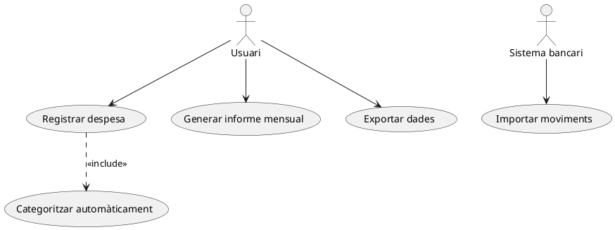
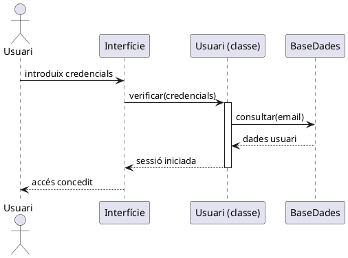
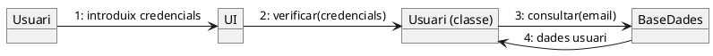
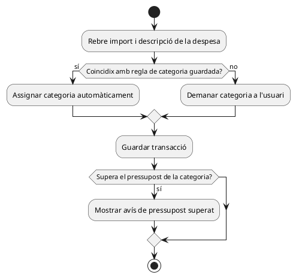
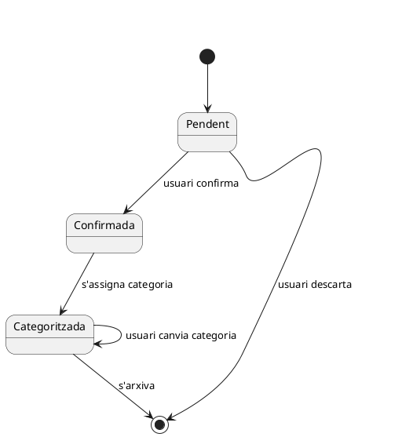

<div style="text-align: center;">


<h1>Unitat 5</h1>
<h2>Elaboració de diagrames de comportament</h2>

<p>
<strong>Mòdul:</strong> Entorns de Desenvolupament (EDE)<br>
<strong>Cicle formatiu:</strong> 1r DAW (Desenvolupament d'Aplicacions Web)<br>
<strong>Curs:</strong> 2026-2027
</p>

<p>
<strong>Docent:</strong> Noel Marco Biendicho<br>
<strong>Centre:</strong> IES Sant Vicent Ferrer — Algemesí
</p>

</div>

<div style="page-break-after: always;"></div>

## Índex

1. Tipus de diagrames de comportament (CA 6a)
2. Diagrama de casos d'ús (CA 6b)
3. Diagrames d'interacció: seqüència i comunicació (CA 6c, 6d)
4. Diagrames d'activitat (CA 6e, 6f)
5. Diagrames d'estat (CA 6g, 6h)
6. Repte de classe
7. Resum de la unitat
8. Per a saber-ne més

<div style="page-break-after: always;"></div>

**RA cobert:** RA6 (CA 6a-6h) — Genera diagrames de comportament valorant la seua importància per a documentar el disseny d'una aplicació.

> 💡 **Nota d'estudi**: en UD4 vas modelar l'**estructura** del tauler de finances (quines classes hi ha i com es relacionen). Esta unitat modela el seu **comportament**: què passa quan algú l'usa, en quin ordre ocorren les coses i per quins estats passa cada element.

> 💻 **Com treballar els exercicis d'esta unitat**: continua en la teua carpeta `UD05_ElTeuNom` dins del repositori del dashboard. Tots els diagrames es fan en PlantUML (la mateixa ferramenta que en UD4, amb la seua pròpia sintaxi per a cada tipus de diagrama).

## 🎯 Conceptes clau

En acabar esta unitat sabràs:
- Distingir els distints tipus de diagrames de comportament UML i per a què servix cadascun.
- Interpretar i elaborar diagrames de casos d'ús, d'interacció (seqüència i comunicació), d'activitat i d'estat.
- Triar quin diagrama de comportament usar segons què calga documentar: què pot fer un usuari, en quin ordre ocorren les coses, o per quins estats passa un objecte.

---

## 1. Tipus de diagrames de comportament (CA 6a)

> 🗺️ **Mapa visual — quina pregunta respon cada diagrama**

| Diagrama | Pregunta que respon | Exemple en el dashboard |
|---|---|---|
| **Casos d'ús** | Què pot fer cada tipus d'usuari? | Registrar despesa, generar informe, exportar dades |
| **Seqüència** | En quin ordre s'envien els missatges entre objectes, amb el temps? | Inici de sessió pas a pas |
| **Comunicació** | Quins objectes s'envien missatges entre si (sense importar l'ordre temporal exacte)? | Els mateixos missatges de l'inici de sessió, vists com a xarxa d'objectes |
| **Activitat** | Quin flux de passos i decisions seguix un procés? | Procés de categorització automàtica d'una despesa |
| **Estat** | Per quins estats passa un objecte al llarg de la seua vida? | Cicle de vida d'una `Transaccio`: pendent → confirmada → categoritzada |

Els dos primers (casos d'ús, interacció) documenten **què interactua amb què**; activitat i estat documenten **com canvien les coses amb el temps** dins d'un mateix procés o objecte.

---

## 2. Diagrama de casos d'ús (CA 6b)

Un **cas d'ús** és una funcionalitat completa que un **actor** (persona o sistema extern) pot realitzar. El diagrama no mostra com es fa, només què es pot fer i qui ho fa.



| Element | Significat |
|---|---|
| Actor (ninot) | Qui interactua amb el sistema (persona o sistema extern) |
| Oval | Un cas d'ús (una funcionalitat completa) |
| Línia actor-cas d'ús | L'actor participa en eixe cas d'ús |
| `<<include>>` | Un cas d'ús inclou obligatòriament un altre |
| `<<extend>>` | Un cas d'ús estén opcionalment un altre |

**🧪 Exercici 1 — Casos d'ús del dashboard**
En `exercici1.puml`, dibuixa el diagrama de casos d'ús complet del tauler de finances: identifica almenys 2 actors (per exemple, Usuari i Sistema bancari extern) i 5 casos d'ús, amb almenys una relació `<<include>>` o `<<extend>>`.

---

## 3. Diagrames d'interacció: seqüència i comunicació (CA 6c, 6d)

### 3.1. Diagrama de seqüència: interpretar

El diagrama de seqüència mostra l'**ordre temporal** en què els objectes s'envien missatges, llegint-se de dalt a baix.



| Element | Significat |
|---|---|
| Línia vertical davall cada objecte | **Línia de vida**: l'objecte existix durant eixe temps |
| Rectangle estret sobre la línia de vida | **Activació**: l'objecte està executant alguna cosa en eixe moment |
| Fletxa contínua | Missatge síncron (espera resposta) |
| Fletxa discontínua | Missatge de resposta |

### 3.2. Diagrama de seqüència: elaborar

**🧪 Exercici 2 — Seqüència d'inici de sessió**
En `exercici2.puml`, elabora el diagrama de seqüència complet de l'inici de sessió del dashboard (pots partir de l'exemple del punt 3.1 i ampliar-lo amb almenys un cas d'error: credencials incorrectes).

### 3.3. Diagrama de comunicació: interpretar

Mostra els **mateixos missatges** que un diagrama de seqüència, però organitzats com una xarxa d'objectes en compte d'una línia temporal — l'ordre s'indica numerant els missatges en compte de amb la posició vertical.



> 📡 **Per què importa hui**: seqüència i comunicació documenten exactament el mateix amb distint èmfasi — seqüència ressalta el **temps**, comunicació ressalta **qui parla amb qui**. Es tria un o altre segons què es vulga comunicar, no perquè un siga "millor".

### 3.4. Diagrama de comunicació: elaborar

**🧪 Exercici 3 — Comunicació del registre d'una despesa**
En `exercici3.puml`, elabora el diagrama de comunicació (no de seqüència) del procés de registrar una despesa nova en el dashboard, numerant els missatges en l'ordre correcte.

---

## 4. Diagrames d'activitat (CA 6e, 6f)

### 4.1. Interpretar un diagrama d'activitat

Modela el **flux d'un procés**: passos, decisions i camins alternatius — molt paregut a un diagrama de flux clàssic, però amb notació UML.



| Element | Significat |
|---|---|
| Cercle ple | Inici del procés |
| Cercle amb vora | Fi del procés |
| Rectangle arredonit | Una acció |
| Rombe (`if/then/else`) | Una decisió amb camins alternatius |

### 4.2. Elaborar un diagrama d'activitat

**🧪 Exercici 4 — Flux de categorització automàtica**
En `exercici4.puml`, elabora el diagrama d'activitat complet del procés de categorització automàtica d'una despesa (pots ampliar l'exemple del punt 4.1 amb un pas addicional, per exemple revisar si la despesa és recurrent).

**🧪 Exercici 5 — Flux de generació d'un informe mensual**
En `exercici5.puml`, elabora el diagrama d'activitat del procés de generar un informe mensual: des que l'usuari el sol·licita fins que es mostra o exporta, incloent-hi almenys una decisió (per exemple, si hi ha o no transaccions eixe mes).

---

## 5. Diagrames d'estat (CA 6g, 6h)

### 5.1. Interpretar un diagrama d'estat

Modela els **estats** pels quals passa un únic objecte al llarg de la seua vida, i quin esdeveniment provoca cada canvi d'estat.



| Element | Significat |
|---|---|
| `[*]` inicial | Punt d'inici (l'objecte encara no existix com a tal) |
| Oval | Un estat |
| Fletxa amb etiqueta | Un esdeveniment que provoca la transició d'un estat a un altre |
| `[*]` final | Punt de fi (l'objecte deixa de tindre eixe cicle de vida) |

### 5.2. Elaborar un diagrama d'estat

**🧪 Exercici 6 — Cicle de vida d'un Pressupost**
En `exercici6.puml`, elabora el diagrama d'estat complet d'un `Pressupost` (d'UD4): per exemple, estats com *Actiu*, *A prop del límit*, *Superat* i *Tancat (fi de mes)*, amb els esdeveniments que provoquen cada transició.

---

## 🎯 Repte de classe

Documentaràs el comportament complet de la funcionalitat de **pressupostos per categoria** que ja vas dissenyar estructuralment en el Repte d'UD4.

En la teua carpeta `UD05`, crea els fitxers següents:

1. **Cas d'ús** (CA 6b): `repte_casus.puml` — el cas d'ús "Consultar estat del pressupost", amb almenys un actor i una relació `<<include>>` o `<<extend>>`.
2. **Interacció** (CA 6c, 6d): `repte_sequencia.puml` — el diagrama de seqüència **o** de comunicació (a la teua elecció) de què ocorre quan una transacció nova fa que se supere un pressupost.
3. **Activitat** (CA 6e, 6f): `repte_activitat.puml` — el flux complet de comprovació de pressupost en registrar una despesa, amb almenys una decisió.
4. **Estat** (CA 6g, 6h): `repte_estat.puml` — el cicle de vida complet del `Pressupost` (pots reutilitzar i ampliar l'Exercici 6).

En `repte.md`, enllaça els 4 diagrames i explica en 3-4 línies per què cadascun documenta un aspecte distint de la mateixa funcionalitat.

**Plantilla orientativa per a `repte.md`:**

```markdown
# Repte — Comportament del sistema de pressupostos

## 1. Cas d'ús
- Fitxer: repte_casus.puml
- Actor(s): ___

## 2. Interacció (seqüència o comunicació)
- Fitxer: repte_sequencia.puml
- Tipus triat i per què: ___

## 3. Activitat
- Fitxer: repte_activitat.puml
- Decisió/ns inclosa/es: ___

## 4. Estat
- Fitxer: repte_estat.puml
- Estats i esdeveniments: ___

## Per què 4 diagrames i no un de sol
___
```

*Variació avaluable*: qui ho preferisca pot documentar una funcionalitat pròpia distinta als pressupostos (per exemple, l'exportació de dades), sempre que use els 4 tipus de diagrama d'esta unitat sobre eixa mateixa funcionalitat.

---

<div style="page-break-after: always;"></div>

## Resum de la unitat

**1. Tipus de diagrames de comportament** Casos d'ús i interacció documenten què interactua amb què; activitat i estat documenten com canvien les coses amb el temps.

**2. Diagrama de casos d'ús** Mostra quines funcionalitats completes pot realitzar cada actor, sense detallar com es fan — amb relacions `<<include>>` i `<<extend>>` entre casos d'ús.

**3. Diagrames d'interacció** Seqüència (ordre temporal, línies de vida i activacions) i comunicació (xarxa d'objectes amb missatges numerats) documenten la mateixa informació amb distint èmfasi.

**4. Diagrames d'activitat** Modelen el flux de passos i decisions d'un procés, de forma paregut a un diagrama de flux clàssic.

**5. Diagrames d'estat** Modelen els estats pels quals passa un objecte al llarg de la seua vida i els esdeveniments que provoquen cada transició.

---

## 📚 Per a saber-ne més (opcional, no avaluable)

- PlantUML — diagrames de casos d'ús: https://plantuml.com/es/use-case-diagram
- PlantUML — diagrames de seqüència: https://plantuml.com/es/sequence-diagram
- PlantUML — diagrames d'activitat: https://plantuml.com/es/activity-diagram-beta
- PlantUML — diagrames d'estat: https://plantuml.com/es/state-diagram

### 🧭 Per què et servirà açò de veritat

Un diagrama de classes (UD4) diu de què està fet un sistema; els diagrames d'esta unitat diuen com es comporta quan algú l'usa de veritat — són les dos mitats de la documentació de disseny que qualsevol equip espera trobar abans de tocar el codi d'un projecte que no ha escrit.
